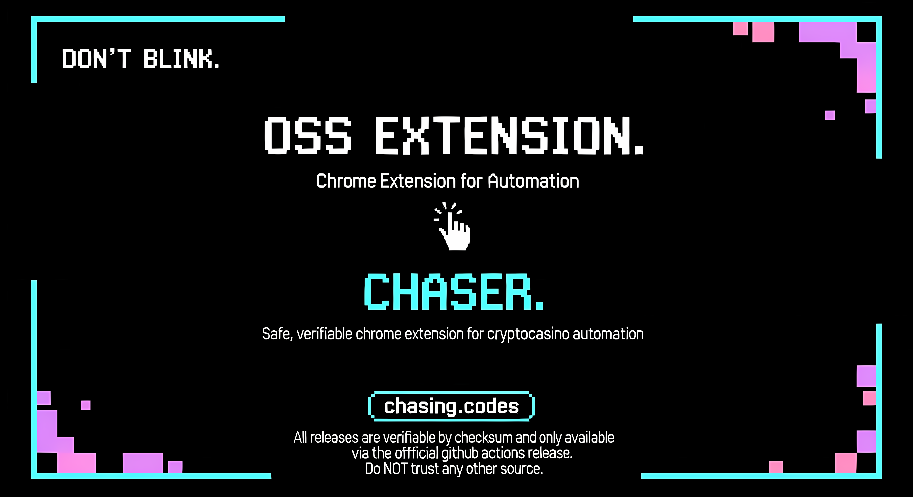

<div align="center">



# Chaser OSS

**Open-source Chrome extension for automating bonus claims and reload management on Stake.com**

[](https://github.com/chasing-codes/chaser-oss/releases)
[](https://www.google.com/chrome/)
[](LICENSE)
[](https://developer.chrome.com/docs/extensions/)

[](https://chasing.codes)
[](https://github.com/chasing-codes/chaser-oss)
[](https://github.com/chasing-codes/chaser-oss/issues)

Built with transparency and user security as core principles. No obfuscation, no hidden code, no malicious intent.

[Features](#features) • [Installation](#installation) • [Usage](#usage) • [Security](#security--privacy) • [Contributing](#contributing)

</div>

---

## Table of Contents

- [Overview](#overview)
- [Critical Security Warning](#critical-security-warning)
- [Features](#features)
- [Installation](#installation)
- [Usage](#usage)
- [Configuration](#configuration)
- [Architecture](#architecture)
- [API Reference](#api-reference)
- [Security & Privacy](#security--privacy)
- [Development](#development)
- [Troubleshooting](#troubleshooting)
- [Contributing](#contributing)
- [License](#license)
- [About Chaser](#about-chaser)

## Overview

Chaser OSS is a fully transparent Chrome extension that automates the claiming of bonuses and reload rewards on Stake.com using your existing authenticated browser session. The extension connects to a community-provided bonus code distribution service and leverages Stake.com's GraphQL API to automatically claim rewards without requiring manual intervention.

**Version:** 0.1.0
**Minimum Chrome Version:** 110
**Repository:** https://github.com/chasing-codes/chaser-oss

This project was created in response to the proliferation of heavily obfuscated, paid claimer extensions that pose significant security risks to users. Chaser OSS provides the same functionality with complete source code transparency, ensuring users can verify exactly what the extension does.

## Critical Security Warning

### DO NOT USE OBFUSCATED BROWSER EXTENSIONS

Multiple cryptocurrency casino claimer services distribute heavily obfuscated Chrome extensions that request extensive browser permissions. These extensions represent a severe security risk:

**Specific Warning - claimer.diobot.app:**
This service distributes an obfuscated extension that runs with full browser permissions. Despite deobfuscation efforts, significant portions of the code remain unreadable, making it impossible to verify whether the extension:
- Collects login credentials and session cookies
- Harvests passwords and credit card information
- Exfiltrates private keys or wallet data
- Contains backdoors or malware

**Why This Matters:**
A malicious Chrome extension with broad permissions can silently steal all your sensitive data without triggering antivirus alerts. The obfuscation itself indicates intent to hide functionality from users. There is no legitimate technical reason to obfuscate a casino bonus claimer.

**As of this writing, approximately 700 users are running the claimer.diobot.app extension.** If you are one of them, we strongly recommend:
1. Immediately uninstalling the extension
2. Changing all passwords for accounts accessed in that browser
3. Reviewing your account activity for unauthorized access
4. Migrating to Chaser OSS or other transparent alternatives

Chaser OSS provides complete source code transparency. Every line of code is readable and auditable. There are no hidden functions, no encrypted payloads, and no obfuscated logic.

## Features

### Automatic Bonus Claiming
- Real-time bonus code distribution via Server-Sent Events (SSE)
- Automatic claiming with configurable on/off toggle
- Manual bonus code input for direct claiming
- Cloudflare Turnstile CAPTCHA verification
- Multi-currency support (BTC, ETH, LTC, DOGE, BCH, USDT, USDC, USD)
- Detailed success/failure logging with timestamps

### Reload Automation
- Periodic reload availability checking (configurable interval)
- Intelligent scheduling system that switches from polling to precise scheduling when reload is imminent
- Automatic claiming when reload becomes available
- Manual refresh trigger for on-demand status checks
- Configurable threshold for scheduling behavior

### User Interface
- Minimalist floating pill interface with expand/collapse
- Premium dark theme with gradient styling
- Real-time connection status indicator
- Comprehensive activity logging (last 200 events)
- Toast notifications for all actions
- Statistics dashboard showing claim history
- Advanced settings panel with validation

### Security Features
- Uses existing browser session (no credential storage)
- Header sanitization to prevent injection attacks
- Two-stage Turnstile injection with world isolation
- Content Security Policy handling for compatibility
- Simple session cookie authentication (no token storage)
- Maximum 200 log entries to prevent memory bloat

## Installation

### Official Release (Recommended)

Download verified releases from the official GitHub releases page.

1. Visit https://github.com/chasing-codes/chaser-oss/releases

2. Download the latest `chaser-oss-vX.Y.Z.zip` file

3. Download the corresponding `.sha256` checksum file

4. Verify the download integrity:

**Linux/macOS:**
```bash
sha256sum -c chaser-oss-v0.1.0.zip.sha256
```

**Windows (PowerShell):**
```powershell
$expected = (Get-Content chaser-oss-v0.1.0.zip.sha256).Split()[0]
$actual = (Get-FileHash chaser-oss-v0.1.0.zip -Algorithm SHA256).Hash
if ($expected -eq $actual) { "OK: Checksum verified" } else { "ERROR: Checksum mismatch" }
```

5. Extract the ZIP file:
```bash
unzip chaser-oss-v0.1.0.zip -d chaser-oss
```

6. Open Chrome and navigate to `chrome://extensions/`

7. Enable "Developer mode" using the toggle in the top-right corner

8. Click "Load unpacked" and select the extracted `chaser-oss` directory

9. The extension icon should appear in your browser toolbar

10. Navigate to https://stake.com and ensure you are logged in

11. The Chaser OSS interface will appear at the bottom-right of the page

**Security Note:** Always verify the SHA256 checksum before installation. Only download from official GitHub releases. Never install extensions from untrusted sources or random ZIP files.

### From Source

For developers or those who want to audit the source code before installation:

1. Clone this repository:
```bash
git clone https://github.com/chasing-codes/chaser-oss.git
cd chaser-oss
```

2. (Optional) Verify git commit signatures if available

3. Audit the source code to ensure no malicious content

4. Open Chrome and navigate to `chrome://extensions/`

5. Enable "Developer mode" using the toggle in the top-right corner

6. Click "Load unpacked" and select the `chaser_oss` directory

7. The extension icon should appear in your browser toolbar

8. Navigate to https://stake.com and ensure you are logged in

9. The Chaser OSS interface will appear at the bottom-right of the page

### Verification

After installation, verify the extension is working:
- Look for the cyan/teal floating pill at the bottom-right of stake.com
- Click to expand and check the connection status indicator
- The status should show "Connected" with a pulsing animation
- Check the activity log for initialization messages

## Usage

### First-Time Setup

1. Navigate to https://stake.com and log in to your account

2. The Chaser OSS interface will automatically appear as a minimized pill

3. Click the pill to expand the control panel

4. Configure your preferences:
   - Toggle "Auto-Claim Bonuses" to enable/disable automatic bonus claiming
   - Toggle "Auto-Claim Reloads" to enable/disable automatic reload claiming
   - Select your preferred claiming currency from the dropdown
   - Adjust reload check interval (minimum 5 minutes, default 60)
   - Set short reload threshold for scheduling behavior (default 10 minutes)

5. Click "Refresh Reload Status" to perform an initial reload check

### Claiming Bonuses

**Automatic Mode:**
- Ensure "Auto-Claim Bonuses" is enabled
- The extension automatically listens to the event stream at `https://pub.chasing.codes/stream`
- When a bonus code is broadcast, the extension will automatically claim it
- Results appear in the activity log and status section

**Manual Mode:**
- Type a bonus code in the "Bonus Code" input field
- Click "Claim Bonus"
- The extension will process the code with Turnstile verification
- Check the activity log for results

### Managing Reloads

**Automatic Mode:**
- Enable "Auto-Claim Reloads" toggle
- The extension polls reload availability at the configured interval (default: every 60 minutes)
- When reload becomes available within the threshold period (default: 10 minutes), the extension schedules automatic claiming
- Claims are processed automatically with confirmation

**Manual Mode:**
- Click "Refresh Reload Status" to check current availability
- View "Next Reload" time in the statistics section
- The extension will display time remaining or "Available Now" status

### Reading Activity Logs

The activity log shows the last 200 events with timestamps:
- Bonus claims (successful and failed)
- Reload claims and scheduling
- Connection status changes
- Error messages and warnings

Each log entry includes:
- ISO timestamp
- Event description
- Relevant details (amounts, codes, errors)

## Configuration

### Settings Object

All settings are stored in Chrome's local storage under the key `chaserSettings`:

```javascript
{
  streamUrl: "https://pub.chasing.codes/stream",
  autoClaimBonus: true,
  autoClaimReloads: true,
  reloadCheckIntervalMinutes: 60,
  shortReloadThresholdMinutes: 10,
  currency: "usdt"
}
```

### Settings Descriptions

| Setting | Type | Default | Description |
|---------|------|---------|-------------|
| `streamUrl` | string | `https://pub.chasing.codes/stream` | Event stream endpoint for bonus code distribution |
| `autoClaimBonus` | boolean | `true` | Enable automatic bonus claiming from stream |
| `autoClaimReloads` | boolean | `true` | Enable automatic reload claiming |
| `reloadCheckIntervalMinutes` | number | `60` | Minutes between reload availability checks (min: 5) |
| `shortReloadThresholdMinutes` | number | `10` | Switch to scheduling if reload available within N minutes |
| `currency` | string | `"usdt"` | Preferred currency for claims |

### Supported Currencies

- `btc` - Bitcoin
- `eth` - Ethereum
- `ltc` - Litecoin
- `doge` - Dogecoin
- `bch` - Bitcoin Cash
- `usdt` - Tether
- `usdc` - USD Coin
- `usd` - US Dollar

### Advanced Configuration

**Custom Event Stream:**
If you are running your own bonus code distribution service, update the `streamUrl` in the advanced settings panel. The endpoint must support Server-Sent Events (SSE) with messages in the format:

```
data: {"type": "bonus_code", "code": "EXAMPLECODE"}
```

**Reload Polling Strategy:**
The extension uses a two-tier system:
1. **Long Polling:** Checks every N minutes (configured interval)
2. **Scheduled Claiming:** When reload is available within threshold minutes, switches to precise scheduling

Adjust `shortReloadThresholdMinutes` to control when this switch occurs. Lower values reduce unnecessary polling but may miss short-window reloads.

## Architecture

### Project Structure

```
chaser_oss/
├── manifest.json           # Extension manifest (Manifest V3)
├── background.js           # Service worker for settings and message relay
├── content/
│   ├── content.js          # Core automation logic and API integration
│   └── ui.js               # User interface and DOM management
└── assets/
    ├── icon16.png          # Extension icon (16x16)
    ├── icon48.png          # Extension icon (48x48)
    └── icon128.png         # Extension icon (128x128)
```

### Component Overview

**background.js (Service Worker)**
- Settings persistence using Chrome Storage API
- GraphQL request relay with header sanitization
- Turnstile widget injection via scripting API
- Message routing between content scripts and background
- Default settings initialization on installation

**content/content.js (Core Logic)**
- `TurnstileManager` class for CAPTCHA token management
- Session cookie authentication (retrieves `session` cookie)
- Event stream connection and message parsing
- Reload polling and intelligent scheduling system
- GraphQL API wrappers for mutations and queries
- Bonus and reload claiming workflows
- Settings observation and live updates

**content/ui.js (Interface)**
- `ChaserUI` class for complete UI system
- Minimized pill and expanded panel states
- Premium dark theme with CSS gradients
- Toast notification system
- Activity log display and management
- Settings binding and validation
- Real-time status updates via storage listeners

### Communication Flow

```
┌─────────────────────────────────────────────────────┐
│                  Content Script                      │
│  ┌────────────────────────────────────────────────┐ │
│  │             Event Stream (SSE)                  │ │
│  │   https://pub.chasing.codes/stream             │ │
│  └────────────────────────────────────────────────┘ │
│                         ↓                            │
│  ┌────────────────────────────────────────────────┐ │
│  │         Bonus Code Received                     │ │
│  └────────────────────────────────────────────────┘ │
│                         ↓                            │
│  ┌────────────────────────────────────────────────┐ │
│  │     Get Session Cookie (session=...)           │ │
│  └────────────────────────────────────────────────┘ │
│                         ↓                            │
│  ┌────────────────────────────────────────────────┐ │
│  │      Request Turnstile Token                    │ │
│  └────────────────────────────────────────────────┘ │
│                         ↓                            │
└─────────────────────────────────────────────────────┘
                          ↓
          chrome.runtime.sendMessage()
                          ↓
┌─────────────────────────────────────────────────────┐
│              Background Service Worker               │
│  ┌────────────────────────────────────────────────┐ │
│  │   Inject Turnstile Widget (MAIN world)         │ │
│  │   chrome.scripting.executeScript()              │ │
│  └────────────────────────────────────────────────┘ │
│                         ↓                            │
│  ┌────────────────────────────────────────────────┐ │
│  │        Turnstile Token Generated                │ │
│  └────────────────────────────────────────────────┘ │
└─────────────────────────────────────────────────────┘
                          ↓
            window custom event
                          ↓
┌─────────────────────────────────────────────────────┐
│                  Content Script                      │
│  ┌────────────────────────────────────────────────┐ │
│  │         Receive Turnstile Token                 │ │
│  └────────────────────────────────────────────────┘ │
│                         ↓                            │
│  ┌────────────────────────────────────────────────┐ │
│  │    GraphQL Mutation: ClaimConditionBonusCode   │ │
│  │         via Background Message Relay            │ │
│  └────────────────────────────────────────────────┘ │
│                         ↓                            │
│  ┌────────────────────────────────────────────────┐ │
│  │      Process Response & Update UI               │ │
│  └────────────────────────────────────────────────┘ │
└─────────────────────────────────────────────────────┘
```

### Authentication Token Discovery

The extension retrieves the Stake.com authentication token from the `session` cookie:

```javascript
function discoverAccessToken() {
  // Stake.com uses a simple 'session' cookie for authentication
  const sessionCookie = getCookieValue("session");
  return sessionCookie || "";
}
```

Stake.com (built with SvelteKit) stores the user's session token as a plain HTTP cookie named `session`. The extension transmits this token in two ways for all GraphQL requests:

1. **As a header**: `x-access-token: <session_value>`
2. **As a cookie**: `session=<session_value>` (automatically included by the browser)

This dual transmission ensures compatibility with Stake.com's authentication requirements.

### Turnstile CAPTCHA Integration

Cloudflare Turnstile verification uses a two-stage injection process:

**Stage 1 - Content Script (ISOLATED world):**
- Creates unique instance ID for token request
- Sends injection message to background service worker
- Sets up custom event listener for token delivery

**Stage 2 - Background Service Worker (MAIN world):**
- Executes script in MAIN world context via `chrome.scripting.executeScript()`
- Loads Turnstile SDK from `https://challenges.cloudflare.com/turnstile/v0/api.js`
- Renders widget with sitekey: `0x4AAAAAAAGD4gMGOTFnvupz`
- Emits token via custom window event

**Stage 3 - Token Delivery:**
- Content script receives token via event listener
- Token passed to GraphQL mutation for verification
- Automatic cleanup after 30 seconds to prevent memory leaks

### Reload Scheduling Logic

The extension implements an intelligent three-tier reload management system:

**Tier 1 - Long Polling:**
```
Every N minutes (configurable):
  └─ Query VipMeta (GraphQL)
     └─ Check reload.active and reload.lastClaim
```

**Tier 2 - Short Threshold Detection:**
```
If reload available in < M minutes (threshold):
  └─ Cancel polling
     └─ Schedule precise timeout for availability time
```

**Tier 3 - Scheduled Claiming:**
```
Timeout fires at exact availability:
  └─ Claim reload immediately
     └─ Wait 5 seconds
        └─ Refetch VipMeta to confirm
           └─ Restart long polling
```

This approach minimizes API requests while ensuring precise claiming when reload becomes available.

## API Reference

### GraphQL Operations

Chaser OSS interacts with Stake.com's GraphQL API at `https://stake.com/_api/graphql`.

#### ClaimConditionBonusCode Mutation

Claims a bonus code with CAPTCHA verification.

```graphql
mutation ClaimConditionBonusCode(
  $code: String!,
  $currency: CurrencyEnum!,
  $turnstileToken: String!
) {
  claimConditionBonusCode(
    code: $code,
    currency: $currency,
    turnstileToken: $turnstileToken
  ) {
    amount
    currency
    bonusCode {
      id
      code
    }
  }
}
```

**Variables:**
```json
{
  "code": "EXAMPLECODE",
  "currency": "usdt",
  "turnstileToken": "0.ABC123..."
}
```

**Response:**
```json
{
  "data": {
    "claimConditionBonusCode": {
      "amount": "100",
      "currency": "usdt",
      "bonusCode": {
        "id": "bonus_id",
        "code": "EXAMPLECODE"
      }
    }
  }
}
```

#### VipMeta Query

Retrieves user VIP information including reload/faucet status.

```graphql
query VipMeta($dailyBonusEnabled: Boolean!, $topUpEnabled: Boolean!) {
  user {
    id
    isBanned
    isSuspended
    rakeback {
      enabled
      balances {
        currency
        availableAmount
      }
    }
    reload: faucet {
      id
      value
      active
      claimInterval
      lastClaim
      expireAt
      createdAt
      updatedAt
      expireCount
    }
  }
}
```

**Variables:**
```json
{
  "dailyBonusEnabled": false,
  "topUpEnabled": false
}
```

**Response:**
```json
{
  "data": {
    "user": {
      "reload": {
        "id": "faucet_id",
        "value": "100",
        "active": true,
        "claimInterval": 86400000,
        "lastClaim": "2025-01-01T12:00:00Z",
        "expireAt": null,
        "createdAt": "2025-01-01T00:00:00Z",
        "updatedAt": "2025-01-01T12:00:00Z",
        "expireCount": 0
      }
    }
  }
}
```

#### ClaimFaucet Mutation

Claims the reload/faucet reward.

```graphql
mutation ClaimFaucet($currency: CurrencyEnum!, $turnstileToken: String!) {
  claimReload: claimFaucet(currency: $currency, turnstileToken: $turnstileToken) {
    id
    amount(currency: $currency)
  }
}
```

**Variables:**
```json
{
  "currency": "usdt",
  "turnstileToken": "0.ABC123..."
}
```

**Response:**
```json
{
  "data": {
    "claimReload": {
      "id": "claim_id",
      "amount": "100"
    }
  }
}
```

### Required Headers

All GraphQL requests must include:

```
Content-Type: application/json
Accept: application/json
x-access-token: [user's access token]
x-operation-name: [mutation/query name]
x-operation-type: [mutation|query]
```

The extension automatically discovers the access token and sets appropriate headers.

### Event Stream Format

The bonus code distribution service uses Server-Sent Events (SSE) with the following message format:

```
data: {"type": "bonus_code", "code": "EXAMPLECODE"}

data: {"type": "reload_alert"}
```

**Message Types:**
- `bonus_code`: Bonus code available for claiming (includes `code` field)
- `reload_alert`: Trigger reload availability check

## Security & Privacy

### Security Measures

**Header Sanitization:**
The extension strips sensitive headers before forwarding GraphQL requests to prevent injection attacks:
- `origin`
- `referer`
- `cookie`
- `host`

**CSRF Protection:**
- Uses browser credentials with `credentials: "include"`
- Token-based authentication via `x-access-token` header
- Respects same-origin policy

**Turnstile Isolation:**
- Content scripts run in ISOLATED world
- Turnstile widget injected into MAIN world only when needed
- Token delivery via custom events prevents direct exposure

**Content Security Policy Handling:**
- Removes CSP meta tags that would block Turnstile SDK
- Mutation observer monitors for CSP re-injection
- Minimal CSP relaxation (only for Turnstile domain)

**Message Validation:**
- Type checking on all incoming messages
- Payload validation before processing
- Unknown message types rejected

### Privacy Considerations

**Data Storage:**
The extension stores only the following data locally:
- User preferences (toggles, currency, intervals)
- Activity logs (timestamps, event names, claim results)
- Connection status

**NOT stored:**
- Session tokens (retrieved from cookies on-demand only)
- Login credentials
- Wallet addresses
- Transaction history
- Personal information

**Network Requests:**
The extension makes requests to:
1. `https://stake.com/_api/graphql` - Using your authenticated session
2. `https://pub.chasing.codes/stream` - Public bonus code distribution (SSE)
3. `https://challenges.cloudflare.com/*` - Turnstile CAPTCHA verification

All requests originate from your browser. No proxy or third-party relay is used.

**Session Handling:**
- Uses existing authenticated browser session
- Does NOT store or transmit login credentials
- Works only when user is logged into Stake.com
- Session token retrieved from `session` cookie on-demand

**Logging:**
- Activity logs kept in browser local storage (max 200 entries)
- Logs contain timestamps and event descriptions
- No sensitive data (tokens, amounts, wallet info) stored in logs
- Logs cleared when browser data is wiped

### Permissions Breakdown

**Required Permissions:**
- `storage` - Persist settings and status across browser sessions
- `scripting` - Inject Turnstile widget into MAIN world context
- `tabs` - Validate message sender tab IDs

**Host Permissions:**
- `https://stake.com/*` - Access to Stake.com for content script injection
- `https://pub.chasing.codes/*` - Bonus code event stream connection
- `https://challenges.cloudflare.com/*` - Turnstile CAPTCHA widget loading

These permissions are scoped to the minimum required domains. The extension cannot access data from other websites.

## Development

### Prerequisites

- Google Chrome 110 or later
- Basic understanding of Chrome Extension architecture
- Familiarity with JavaScript, DOM APIs, and async/await patterns

### Local Development Setup

1. Clone the repository:
```bash
git clone https://github.com/chasing-codes/chaser-oss.git
cd chaser-oss
```

2. Load the extension in Chrome:
   - Navigate to `chrome://extensions/`
   - Enable "Developer mode"
   - Click "Load unpacked"
   - Select the `chaser_oss` directory

3. Make code changes in your editor

4. Reload the extension:
   - Click the reload icon on the extension card in `chrome://extensions/`
   - Refresh stake.com to see changes in content scripts

### Debugging

**Content Script Debugging:**
1. Open Chrome DevTools on stake.com (F12 or Cmd+Option+I)
2. Navigate to the "Console" tab
3. Look for log messages from content scripts
4. Use `debugger;` statements to set breakpoints

**Background Service Worker Debugging:**
1. Navigate to `chrome://extensions/`
2. Find "Chaser OSS" and click "service worker"
3. DevTools will open for the background context
4. View logs and set breakpoints

**Storage Inspection:**
1. Open DevTools on stake.com
2. Navigate to "Application" → "Storage" → "Local Storage"
3. Look for `chaserSettings` and `chaserStatus` keys

### Code Structure Guidelines

**Adding New Features:**
1. Core logic belongs in `content/content.js`
2. UI components belong in `content/ui.js`
3. Storage operations should go through background service worker
4. Use message passing for communication between contexts

**Styling:**
All styles are inline in `content/ui.js` within the `getStylesheet()` method. Use the established gradient color scheme:
- Primary: `#22d3ee` to `#06b6d4` (cyan to teal)
- Background: `#1a1a1a`, `#2a2a2a` (dark grays)
- Text: `#ffffff`, `#e5e7eb`, `#9ca3af` (white to gray scale)

**Error Handling:**
- Always wrap async operations in try-catch blocks
- Log errors to both console and activity log
- Show user-friendly error messages in toast notifications
- Provide actionable guidance when possible


### Building for Distribution

Chaser OSS uses pure vanilla JavaScript with no build process. To prepare for distribution:

1. Ensure all assets are present:
   - `manifest.json`
   - `background.js`
   - `content/content.js`
   - `content/ui.js`
   - `assets/*.png`

2. Verify manifest version is updated

3. Test thoroughly in clean Chrome profile

4. Create ZIP archive:
```bash
zip -r chaser-oss-v0.1.0.zip . -x "*.git*" -x "*.DS_Store"
```

## Troubleshooting

### Extension Not Appearing on Stake.com

**Symptoms:** No UI visible after navigating to stake.com

**Solutions:**
1. Verify extension is enabled in `chrome://extensions/`
2. Check that you are on `https://stake.com/*` (not http or different domain)
3. Hard refresh the page (Cmd+Shift+R or Ctrl+Shift+F5)
4. Check console for error messages (F12 → Console)
5. Reload the extension in `chrome://extensions/`

### Connection Status Shows "Disconnected"

**Symptoms:** Status indicator shows red/disconnected state

**Solutions:**
1. Verify `https://pub.chasing.codes/stream` is accessible (check network tab)
2. Check browser's network connectivity
3. Ensure no firewall/corporate proxy is blocking SSE connections
4. Try changing the stream URL in advanced settings
5. Check console for stream connection errors

### Bonus Claims Failing

**Symptoms:** Bonus codes fail to claim, error in activity log

**Solutions:**
1. Verify you are logged into Stake.com
2. Check selected currency is valid for your account
3. Ensure bonus code is still active/valid
4. Check for Turnstile errors in console
5. Verify session cookie exists (check console: `document.cookie`)
6. Try manually claiming via Stake.com UI to verify code validity

### Reload Not Claiming Automatically

**Symptoms:** Reload available but not claimed automatically

**Solutions:**
1. Ensure "Auto-Claim Reloads" toggle is enabled
2. Check reload check interval is appropriate (not too long)
3. Verify last reload check time in activity log
4. Click "Refresh Reload Status" to trigger manual check
5. Check console for errors during reload polling

### Turnstile Errors

**Symptoms:** CAPTCHA verification failing, Turnstile error codes in console

**Common Error Codes:**
- `300030/300031` - Widget removal (extension handles with retry)
- `600000/600010` - Configuration error (sitekey may have changed)
- `110100` - Network timeout (check connectivity)

**Solutions:**
1. Refresh the page completely
2. Check if Stake.com has updated their Turnstile sitekey
3. Verify `https://challenges.cloudflare.com/*` is accessible
4. Disable other extensions that might interfere with CAPTCHA

### Settings Not Persisting

**Symptoms:** Settings reset after page reload

**Solutions:**
1. Check Chrome storage permissions are granted
2. Verify no browser extension is clearing storage
3. Check browser's privacy settings (ensure site data is allowed)
4. Try resetting to defaults and reconfiguring

### High Memory Usage

**Symptoms:** Browser tab consuming excessive memory

**Solutions:**
1. Check activity log size (should max at 200 entries)
2. Reload the page to clear accumulated state
3. Check for console errors indicating memory leaks
4. Disable and re-enable the extension

### Extension Conflicts

**Symptoms:** Extension not working when other extensions are enabled

**Solutions:**
1. Disable other Stake-related extensions
2. Check for extensions modifying Stake.com's DOM
3. Disable adblockers/privacy extensions temporarily
4. Check console for CSP or script injection errors

## Contributing

We welcome contributions from the community. Chaser OSS is open-source to ensure transparency and allow users to verify security.

### How to Contribute

1. Fork the repository
2. Create a feature branch (`git checkout -b feature/your-feature`)
3. Commit your changes with descriptive messages
4. Push to your fork (`git push origin feature/your-feature`)
5. Open a Pull Request with detailed description

### Contribution Guidelines

- Maintain code readability and documentation
- Follow existing code style and patterns
- Test thoroughly before submitting PR
- Do not obfuscate or minify code
- Include comments for complex logic
- Update README if adding new features

### Reporting Issues

Found a bug or have a feature request? Please open an issue on GitHub with:
- Clear description of the issue/feature
- Steps to reproduce (for bugs)
- Expected vs actual behavior
- Browser version and extension version
- Console logs (if applicable)

### Code Review Process

All contributions will be reviewed for:
- Code quality and maintainability
- Security implications
- Performance impact
- Compatibility with existing features
- Documentation completeness

## License

Chaser OSS is licensed under the [MIT License](LICENSE).

```
MIT License

Copyright (c) 2025 Chasing Codes

Permission is hereby granted, free of charge, to any person obtaining a copy
of this software and associated documentation files (the "Software"), to deal
in the Software without restriction, including without limitation the rights
to use, copy, modify, merge, publish, distribute, sublicense, and/or sell
copies of the Software, and to permit persons to whom the Software is
furnished to do so, subject to the following conditions:

The above copyright notice and this permission notice shall be included in all
copies or substantial portions of the Software.

THE SOFTWARE IS PROVIDED "AS IS", WITHOUT WARRANTY OF ANY KIND, EXPRESS OR
IMPLIED, INCLUDING BUT NOT LIMITED TO THE WARRANTIES OF MERCHANTABILITY,
FITNESS FOR A PARTICULAR PURPOSE AND NONINFRINGEMENT. IN NO EVENT SHALL THE
AUTHORS OR COPYRIGHT HOLDERS BE LIABLE FOR ANY CLAIM, DAMAGES OR OTHER
LIABILITY, WHETHER IN AN ACTION OF CONTRACT, TORT OR OTHERWISE, ARISING FROM,
OUT OF OR IN CONNECTION WITH THE SOFTWARE OR THE USE OR OTHER DEALINGS IN THE
SOFTWARE.
```

**Summary:** You are free to use, modify, and distribute this software. See the [LICENSE](LICENSE) file for full details.

## About Chaser

Chaser is an organization dedicated to providing secure, transparent automation infrastructure for cryptocurrency casino users. Our mission is to eliminate the security risks posed by obfuscated, malicious browser extensions through open-source alternatives and managed cloud services.

### Our Services

**Chaser OSS (Free Forever)**
- Open-source Chrome extension
- Community-driven development
- Transparent codebase
- Self-hosted option

**Chaser Managed Platform**
- Cloud-native automation infrastructure
- No browser extension required
- Native Stake API integration
- Bank-level security and compliance
- Immutable audit logging
- 99.9%+ reliability
- Sub-0.2 second claim speeds

### Why Managed Platform?

While Chaser OSS provides free, transparent automation through a browser extension, our managed platform offers:
- **No Browser Dependencies:** Runs on sovereign cloud infrastructure (AS211747)
- **Enhanced Security:** Encrypted credential vaulting with audit logging
- **Better Performance:** Direct API integration, no DOM scraping
- **Advanced Features:** Intelligent betting assistant (coming EOY 2025), social integrations
- **Legal Compliance:** Registered legal entity with institutional-grade security

### Contact & Links

- **Website:** https://chasing.codes
- **Repository:** https://github.com/chasing-codes/chaser-oss
- **Support:** Open an issue on GitHub
- **Community:** Join the discussion in GitHub Discussions

### Our Principles

1. **Transparency First:** All code is readable and auditable
2. **User Security:** No credential storage, no data exfiltration
3. **Community-Driven:** Open-source development with public contributions
4. **Zero Tolerance for Obfuscation:** Code should be readable and verifiable

---

**Disclaimer:** This extension is not affiliated with, endorsed by, or sponsored by Stake.com. Use at your own risk. Cryptocurrency gambling involves financial risk and may not be legal in all jurisdictions. Users are responsible for compliance with local laws and regulations.

**Security Notice:** Always verify the source of any browser extension before installation. Only install Chaser OSS from the official GitHub repository at https://github.com/chasing-codes/chaser-oss to ensure code integrity.
